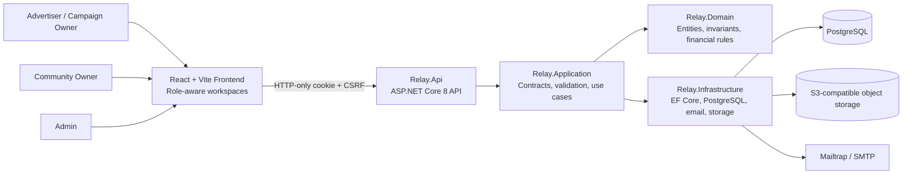
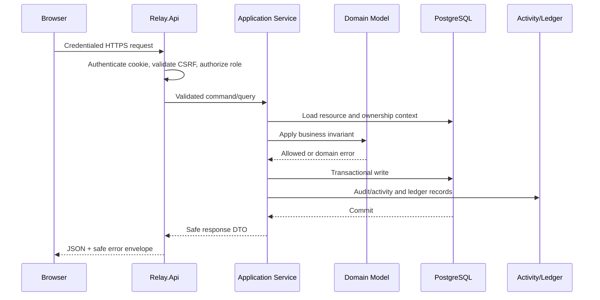
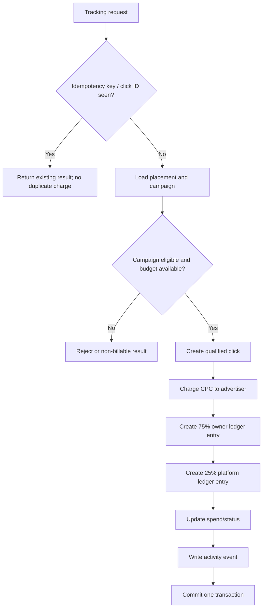

# Relay / Ownerboard Architecture

**Status:** Living document  
**Last updated:** 2026-10-06

## 1. High-level architecture

Relay uses a **modular monolith**. One ASP.NET Core API process exposes versioned HTTP endpoints, while project boundaries keep domain rules, use cases, infrastructure, and transport concerns separate.



### Request and mutation flow



### Qualified-click financial flow



## 2. Technology stack

### Frontend

- React 19 and TypeScript.
- Vite development and production bundling.
- Wouter routing.
- Tailwind CSS plus existing project CSS.
- Lucide React icons.
- Recharts where simple charts are needed.
- LocalStorage fallback during the migration period.

### Backend

- ASP.NET Core 8 on Linux-friendly hosting.
- C# modular monolith.
- Entity Framework Core with Npgsql.
- PostgreSQL as the system-of-record database.
- Cookie authentication with secure HTTP-only cookies.
- Server-side RBAC for Advertiser, CommunityOwner, and Admin.
- CSRF protection for unsafe browser requests.
- Data Protection for protected tokens and cookie data.
- Mailtrap-compatible SMTP adapter for development testing.
- S3-compatible object-storage abstraction for private verification evidence.
- Health checks, structured error handling, rate limiting, and security headers.

### Existing legacy/prototype infrastructure

The repository also contains the original React/Express/tRPC/Drizzle starter infrastructure. It remains part of the current project while the Relay backend becomes authoritative. Do not remove it without a planned migration and regression pass.

## 3. Solution and folder structure

```text
ownerboard/
├── client/
│   ├── src/
│   │   ├── components/          # Shared UI and workspace shells
│   │   ├── contexts/            # Theme and Relay session state
│   │   ├── data/                # Marketplace state and migration fallback
│   │   ├── lib/                 # relayApi and client utilities
│   │   ├── pages/
│   │   │   ├── Admin/
│   │   │   ├── CampaignOwner/
│   │   │   └── CommunityOwner/
│   │   ├── App.tsx
│   │   └── index.css
│   └── index.html
├── backend/
│   ├── src/
│   │   ├── Relay.Domain/        # Core entities and invariants
│   │   ├── Relay.Application/   # Contracts, DTOs, use cases
│   │   ├── Relay.Infrastructure/# EF Core, persistence, adapters
│   │   └── Relay.Api/           # Controllers, middleware, startup
│   ├── tests/Relay.Api.Tests/
│   ├── docs/                   # Backend-specific operational docs
│   └── Relay.sln
├── admin/                       # Existing standalone/static Admin artifacts
├── docs/                        # Product-level source of truth
├── server/                      # Existing starter server/runtime
├── shared/                      # Existing shared starter types
├── drizzle/                     # Existing starter schema/migrations
├── package.json
└── vite.config.ts
```

## 4. Backend project boundaries

### Relay.Domain

Contains entities, enums, value objects, lifecycle transitions, financial rules, and invariants. It must not depend on ASP.NET Core, EF Core, storage SDKs, or frontend code.

### Relay.Application

Contains request/response contracts, validation, service interfaces, authorization-aware use cases, and orchestration. It should depend on Domain abstractions, not concrete database or storage implementations.

### Relay.Infrastructure

Contains `RelayDbContext`, PostgreSQL mappings, repositories/services, email, object storage, Data Protection integration, and external adapters. Infrastructure implements Application interfaces.

### Relay.Api

Contains controllers, authentication configuration, middleware, health checks, API versioning, security headers, CORS, and dependency injection composition. Controllers remain thin and do not contain marketplace business rules.

## 5. Data and security boundaries

- PostgreSQL is the authoritative store for backend-enabled flows.
- LocalStorage is temporary compatibility storage for legacy frontend records.
- Resource queries must filter by current user ownership or Admin policy.
- RLS may add defense in depth but never replaces application authorization.
- Evidence objects are private; Admin review uses short-lived signed URLs.
- Secrets, connection strings, private keys, and cookies must never be returned to the browser or written to logs.

## 6. Deployment model

Development uses local configuration and a development PostgreSQL instance, with Mailtrap for email testing. Staging mirrors production topology and rehearses migrations, backups, restores, and rollback. Production uses environment/secret-manager configuration, HTTPS, secure cookies, structured logs, monitored health checks, and controlled migrations.

Database migrations run as a separate release step. The application does not automatically perform destructive migrations on startup in production.

## 7. Scaling approach

The first production target is a horizontally deployable stateless API with PostgreSQL as the shared state store. Connection pooling, indexes, pagination, efficient EF Core queries, and transactional integrity are preferred before adding distributed infrastructure. Redis, queues, or workers are introduced only after profiling demonstrates a real bottleneck.
